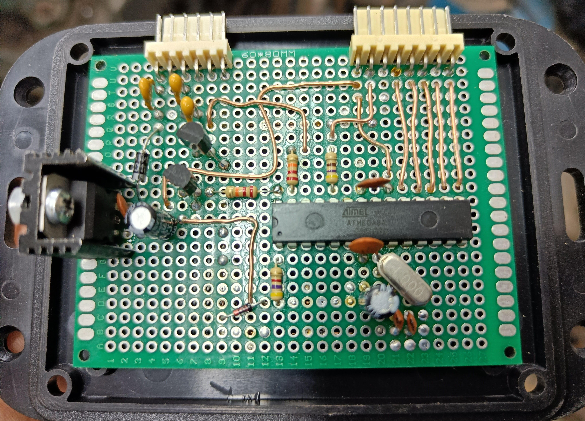
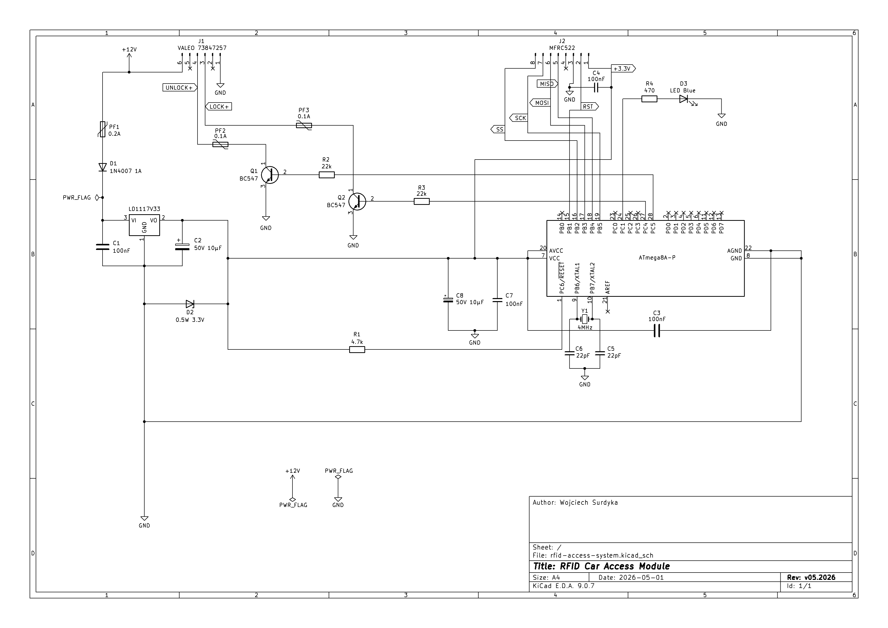

# RFID Car Access System


-orange)


## Project Overview
Embedded access control system for vehicle central locking using RFID authentication.

This project implements a standalone hardware module that allows a car to be locked or unlocked by presenting an RFID tag near the vehicle window. The system reads RFID tags using an MFRC522 reader and authenticates them using an ATmega8A microcontroller.

When a valid tag is detected, the microcontroller toggles the lock state and simulates the vehicle's internal lock/unlock button using transistor-based driver circuits. Locking and unlocking are performed alternately.

The project includes:

- custom embedded firmware written in C (for AVR)
- RFID interface implementation for MFRC522 reader
- watchdog-based system reliability
- custom hardware prototype
- full system documentation

The system was designed as a **complete embedded project**, including both firmware and hardware development.

---
## Demo

The animation below shows the system detecting an RFID tag placed against the car window.  
When a valid tag is detected, the system toggles the lock state and the status LED indicates system activity - locking / unlocking state.


---
## Features

- RFID authentication using MFRC522 reader
- configurable list of authorized RFID tags
- SPI communication between MFRC522 and ATmega8A
- watchdog-based system recovery and reliability
- protection against repeated unauthorized access attempts
- transistor-based drivers for lock and unlock control signals
- modular firmware structure (RFID, SPI, watchdog, system config)
- designed and implemented as a full hardware + firmware embedded project

---
## System Architecture
The system consists of three main functional blocks:

1. **RFID Interface** – MFRC522 reader responsible for detecting and reading RFID tags.
2. **Control Unit** – ATmega8A microcontroller together with supporting hardware (voltage regulator, transistor drivers, LED indicator and firmware responsible for authentication and system logic).
3. **Lock Control Stage** – transistor-based driver circuits used to simulate the vehicle's lock and unlock button signals.

### System Data Flow
<pre>
RFID Tag
   ↓
MFRC522 RFID Reader
   ↓ Serial Peripheral Interface (SPI)
ATmega8A Control Unit
   ↓
Transistor Driver Circuit
   ↓
Vehicle Central Lock Controller
</pre>

### Authentication Flow

1. The system checks for nearby RFID tags every second.
2. When a tag is detected, its UID is read through the SPI interface.
3. The UID is compared with a list of authorized tags stored in firmware.
4. If authentication succeeds, the system toggles the lock state.
5. The microcontroller activates the appropriate transistor driver to simulate a lock or unlock button press.
6. Invalid authentication attempts increase a counter and may trigger a temporary lockout.

The firmware uses a watchdog timer to recover from potential communication errors with the RFID reader.

---
## Hardware

The system hardware is built around an **ATmega8A microcontroller** and an **MFRC522 RFID reader module**.  
The device was initially prototyped on a soldered prototype board and later integrated into the vehicle.

### Hardware Prototype



The prototype includes the following key components:

- **ATmega8A microcontroller** – main control unit responsible for RFID authentication logic
- **MFRC522 RFID reader** – detects and reads RFID tags
- **LD1117 voltage regulator** – provides stable 3.3V supply for the entire access control system
- **BC547B transistors** – used as switching drivers for lock and unlock signals
- **Status LED (blue)** – indicates system activity
- **External 4 MHz crystal oscillator** – provides system clock for the microcontroller

In addition to the main components, the circuit also includes supporting elements such as:
- current limiting resistors
- filtering and decoupling capacitors
- signal conditioning components

### Circuit Schematic

During early development the circuit was designed using a hand-drawn schematic, available at:

[**hardware/handmade-schematic-diagram.png**](hardware/handmade-schematic-diagram.png)

A cleaned-up schematic was recreated in **KiCad** and was shown just below.



See [**docs/kicad-project-files/**](docs/kicad-project-files/) to reach all the **KiCad** project files.

---
## Firmware

The firmware is written in **C (for AVR)** using the **AVR-GCC** toolchain and follows a modular structure.

Project structure

<pre>
firmware
├── main.c
├── include
│     ├── mfrc522-config.h
│     ├── mfrc522.h
│     ├── spi-config.h
│     ├── system-config.h
│     └── wdt-config.h
│
└── src
      ├── mfrc522.c
      ├── spi-config.c
      └── wdt-config.c
</pre>

### Main Firmware Modules

**RFID module (`mfrc522`)**

Handles communication with the MFRC522 RFID reader, including:
- register access
- FIFO communication
- tag detection
- UID retrieval

**SPI interface (`spi-config`)**

Implements low-level SPI communication between the ATmega8A and the MFRC522 reader.

**Watchdog module (`wdt-config`)**

Provides system reliability by enabling the watchdog timer and recovering from unexpected firmware states.

**System configuration (`system-config`)**

Stores configuration parameters such as:

- authorized RFID tag UIDs
- GPIO pin definitions
- lock control configuration

### Main Control Loop

The firmware operates using a continuous polling loop.

Simplified workflow:

1. Initialize SPI interface
2. Initialize RFID reader
3. Continuously scan for RFID tags
4. Read tag UID when detected
5. Validate UID against authorized list
6. Toggle lock state if authentication succeeds
7. Handle invalid authentication attempts
8. Recover from communication errors if necessary
9. Maintain system stability using watchdog timer

---
## Vehicle Integration

The RFID access system integrates with the vehicle's central locking system by electrically simulating the signals generated by the original lock/unlock button.

Instead of modifying the vehicle controller directly, the system uses transistor-based switching circuits to momentarily close either the lock or unlock control lines of the central locking controller.

The access system is powered directly from the vehicle's 12V central locking controller supply and internally regulated to 3.3V for the microcontroller and RFID reader.

A detailed description of the integration process, signal analysis and electrical interface can here:

> 📖 Detailed vehicle integration description: [**docs/vehicle-integration.md**](docs/vehicle-integration.md)

---
## Build Instructions

First, download the repository using `git clone` command, as shown right below:
```
git clone https://github.com/surdykaw/RFID-Car-Access-System.git
```
or just download the entire repository as a ZIP folder.

The firmware is built using avr-gcc compiler with avr-libc package and a Makefile-based build system.

Building the firmware project was tested on:

-   **Linux (Debian)**
-   **Windows using MSYS2 (MINGW64 environment)**

The Makefile uses UNIX-like shell commands such as:

`mkdir`
`rm`

For this reason, on Windows it is recommended to use a POSIX-compatible shell such as:

-   MSYS2 (recommended)
-   Git Bash
-   WSL

### Toolchain Requirements
> [!IMPORTANT]
> The following tools are required:
>-   `avr-gcc`
>-   `avr-libc`
>-   `avrdude`
>-   `make`

### Linux Installation Example

On Debian/Ubuntu-based systems:

```
sudo apt install avr-gcc avr-libc avrdude make
```

### Windows (MSYS2) Installation

Install MSYS2 and then install the AVR toolchain:

```
pacman -S avr-gcc avr-libc avrdude make
```

Use the MINGW64 terminal to build the project.

### Building the Firmware

To compile the firmware run:

```
make build
```

The build process will:

1.  Create the build/ directory
2.  Compile the firmware using avr-gcc
3.  Generate the Intel HEX file using avr-objcopy
4.  Display firmware memory usage using avr-size

Generated files:
<pre>
build/firmware.elf
build/firmware.hex
</pre>
### Flashing the Firmware

The firmware can be uploaded using a USBasp programmer.
Run:
```
make flashupdate
```
The `make flashupdate` indeed executes the one below:

`
avrdude -c usbasp -p m8a -U flash:w:build/firmware.hex
`

Required hardware:

-   **USBasp programmer**
-   **connection to the ATmega8A ISP interface**

### Cleaning Build Files

To remove all generated files run:
```
make clean
```
> [!NOTE]
> This command removes the entire **build/** directory.

---
## License
This project is released under the **MIT License**.

See the `LICENSE` file for details.


